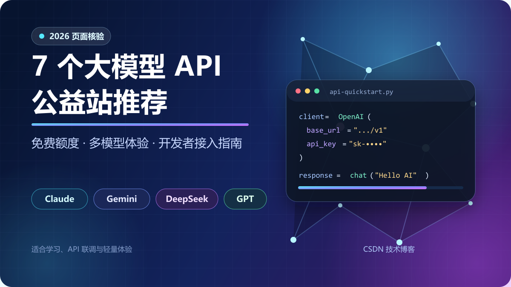

# 2026 页面核验：7 个大模型 API 公益站推荐，注册领免费额度，Claude、Gemini、DeepSeek、GPT 都能体验



> **适合读者：**想低成本体验大模型 API、配置 Cherry Studio，或接入 Claude Code、Cursor、Codex CLI、Gemini CLI 的开发者。
>
> **核验时间：**2026 年 8 月 21 日。本文包含邀请链接，部分平台会给新用户和邀请人发放站内额度。

想学习大模型 API、给 Cherry Studio 配模型，或者折腾 Claude Code、Cursor、Codex CLI、Gemini CLI，最先遇到的问题往往不是代码，而是：**去哪里找一个低门槛的 API 做测试？**

这篇文章整理了 7 个第三方大模型 API 公益站。我逐个访问了注册页、首页、模型广场和公开公告，重点记录它们的模型覆盖、免费额度、接口兼容性和适用场景。

> **重要提醒：**这些站点均为独立第三方服务，并非 OpenAI、Anthropic、Google 等模型厂商的官方网站。免费额度、模型列表、倍率和活动规则都可能调整，请以注册时的页面和实际到账为准。建议只用于学习、联调和轻量体验，不要提交公司代码、隐私数据、密钥或其他敏感内容。

## 直接抄结论

- **额度优先：**肖恩AI
- **AI 编程：**Agent Router、DoCode
- **免费模型和签到：**Liminality
- **客户端适配：**芙卡卡の小食堂
- **公开模型广场：**可萌中转站
- **精简 Claude 路由：**GoRouter

## 7 个平台详细介绍

### 一分钟看懂：7 个站分别适合谁？

| 站点 | 核心优势 | 更适合 |
|---|---|---|
| 肖恩AI | 新人额度、签到和邀请体系 | 想先领额度体验多模型 |
| Agent Router | 多协议统一网关，偏 AI Coding | Claude Code、Codex、Gemini CLI 用户 |
| 芙卡卡の小食堂 | 多模型、多协议、客户端适配 | Cherry Studio、CC Switch 和 API 联调 |
| DoCode | 编程工具接入文档丰富 | Claude Code、Cursor、Codex CLI 用户 |
| Liminality | 免费模型、签到“橘子”体系 | 日常问答、学习和低频体验 |
| 可萌中转站 | 模型广场、按次计费、状态展示 | 想直观看模型和计费方式 |
| GoRouter | 精简的统一 API 网关 | 想测试 Claude 路由和统一接口 |

### 1. 肖恩AI：新人额度最直观，签到和邀请奖励也比较完整

如果你第一次接触大模型 API，我更建议先从这个站开始。它的福利说明最直观：

- 首页当前显示注册基础额度为 **5000 点**；
- 每邀请 1 位好友，双方各得 **2000 点**；
- 因此通过邀请链接建立邀请关系后，新用户按当前规则合计可获得 **7000 点体验额度**；
- 每日签到还可领取 **1000～3000 点**；
- 首页目前展示 Gemini 3.1 系列、Claude Opus 4.7、GPT 5.5 等站内模型名称。

我核验时，注册页的邀请码输入框还出现过“填写获得额外 5000 额度”的提示，与首页“双方各得 2000 点”的口径并不完全一致。本文标题中的 7000 点按首页当前可见规则计算，最终仍以注册后的实际到账为准。

站点还公开说明：部分主动中断、连接超时或上游审查拦截产生的已扣额度可以领取返还，北京时间每月累计最高 5000 点。对于测试长回答、Agent 或代码生成的人来说，这个机制比较实用。

站方本次活动文案还包括以下内容，但公开首页没有完整展示全部细则，需以注册后后台和最新公告为准：

1. 每邀请 1 人，双方各得 2000 额度；
2. 可领取最新前沿预览模型体验资格；
3. 累计邀请 20 人，可获无限量周卡。

活动资格、库存和最终到账请以站内最新公告为准。

> **立即注册：**[肖恩AI 邀请注册链接](https://free.supxh.xin/register?code=QFNL2M)
>
> 奖励和活动以注册页、后台实际到账为准。

### 2. Agent Router：更适合 AI Coding，一套接口接入多种协议

Agent Router 的定位不是单纯的聊天站，而是一个偏开发者的统一大模型接口网关。公开页面展示了多类兼容端点：

- `/v1/chat/completions`
- `/v1/responses`
- `/v1/messages`
- `/v1beta/models`
- Embeddings、Rerank、图片和音频接口

它的文档覆盖 Claude Code、Codex、Gemini CLI、Qwen Code、Cursor、Cline、Roo Code 等常见 AI 编程工具。注册页目前支持使用 **GitHub 或 LinuxDO** 继续注册。

我访问时，首页公告显示一项预计持续到 9 月初的限时活动：每成功邀请 1 位好友，邀请人获得 **150 Credit**，新用户获得 **50 Credit**；持续真实使用且额度不足的用户，还有机会由系统自动补充额度。这里的 Credit 是站内调用额度，不是可提现金额。

> **立即注册：**[Agent Router 邀请注册链接](https://agentrouter.org/register?aff=YiUn)
>
> Credit 为站内调用额度，不是可提现现金。

### 3. 芙卡卡の小食堂：兼容协议丰富，对常见客户端比较友好

“芙卡卡の小食堂”是一家独立的第三方 API 聚合与转发站。首页公开展示 OpenAI、Claude、Gemini、DeepSeek、Qwen、Llama 等模型家族，并演示了 Chat、Responses、Claude、Gemini 等不同协议的接入方式。

它还明确展示了对 **Cherry Studio** 和 **CC Switch** 的适配。如果你不想自己写代码，只想把接口填进桌面客户端里使用，这一类站点会比较省事。

当前公开公告写明：

- 邀请好友注册，**双方各得 50 点**；
- 目前仅开放 **QQ 邮箱验证**；
- 模型广场和具体价格需要登录后查看。

站点也明确声明自己与各上游模型厂商没有官方从属或授权关系，这一点反而写得比较清楚。

> **立即注册：**[芙卡卡の小食堂 邀请注册链接](https://api.fuka.win/sign-up?aff=lkTt)
>
> 当前公告提示仅开放 QQ 邮箱验证。

### 4. DoCode：面向编程工作流，接入教程最丰富的一类

DoCode 的特色很鲜明：它主要围绕开发者的实际工作流来组织内容。公开帮助文档提供了 Claude Code、Codex CLI、Gemini CLI、Cherry Studio、Chatbox、Cline、Aider 等工具的配置方法，同时支持 OpenAI 兼容、Responses、Claude Native 和 Gemini Native 等接口形式。

如果你想做这些事情，它会比较对口：

- 在 Claude Code 中配置第三方 Base URL；
- 给 Codex CLI 添加自定义 provider；
- 在 Cursor、Cline、Aider 中接入 OpenAI 兼容接口；
- 在 Cherry Studio 或 Chatbox 中添加自定义模型。

需要特别说明的是，我访问时站内奖励文案存在更新不同步：

- 注册页明确显示：无邀请码注册 50 额度，**有邀请码注册 100 额度**；
- 首页活动卡同时展示“注册即送 200、拉新成功再送 80”。

因此，不建议把 200 或 80 当作固定承诺。更稳妥的说法是：**注册页当前显示，正确建立邀请关系后新用户额度高于无邀请码注册，具体以实际到账为准。** 邀请参数虽然保留在 URL 中，但注册表单没有直观显示已绑定的邀请码；目前注册仅支持纯数字 QQ 邮箱。

> **立即注册：**[DoCode 邀请注册链接](https://docode.cc/register?aff=Vock)
>
> 注册奖励文案存在不同页面口径，以实际到账为准。

### 5. Liminality：免费模型 0 消耗，每日签到最高 100 个“橘子”

Liminality，也就是这个链接对应的公益站，采用“橘子”作为站内额度。它的吸引力不是一次性送很多，而是免费模型和日常签到机制：

- 多款模型标价 **0 橘子**，可以直接体验；
- 每日签到保底 10 个、最高 100 个橘子；
- 每成功邀请 1 位好友，邀请人获得 50 个橘子；
- 首页称常用付费模型通常为 2～3 个橘子一次；
- 公开模型广场当前展示 **39 个模型**。

模型广场覆盖 OpenAI、Gemini、Claude、DeepSeek、Qwen、Grok、智谱、Moonshot 等分类，也能看到按次和按量两种计费方式。对于日常问答、写作、学习和偶尔试模型的人，这种“免费模型 + 每日签到”的模式比较友好。

不过站方协议明确写明，每个 API Key 每分钟最多 15 次请求，且不提供商业 SLA，因此更适合个人轻量体验，不适合作为生产接口或高并发 Agent 后端。

> **立即注册：**[Liminality 邀请注册链接](https://beizhi.sylu.cc/sign-up?aff=CkUS)
>
> 个人轻量使用更合适，每个 API Key 有频率限制。

### 6. 可萌中转站：公开模型广场和计费方式，适合做接口联调

可萌中转站提供 OpenAI 兼容接口，首页公开的 Base URL 为：

```text
https://api456.me/v1
```

它的模型广场当前展示 29 个模型，覆盖 Claude、DeepSeek、Gemini、OpenAI、智谱和 Qwen 等分类，其中大部分采用按次计费，也有少量按量计费模型。页面还展示模型延迟、成功率等站内统计，查模型时比较直观。

当前邀请链接会自动识别邀请码，注册页明确显示：

- 注册后邀请双方各得 **15 枚硬币**；
- 首页标注这项限时活动截至 **2026 年 8 月 28 日（北京时间）**；
- 每日签到还可随机获得硬币。

活动到期后，奖励数字很可能调整，看到文章较晚的读者请以页面为准。

> **立即注册：**[可萌中转站 邀请注册链接](https://api456.me/register?aff=2lhy)
>
> 邀请活动页面标注截至 2026 年 8 月 28 日，过期后请以新规则为准。

### 7. GoRouter：当前是较精简的 Claude 路由体验站

GoRouter 同样采用统一 API 网关的形式，首页展示 Chat、Responses 等兼容接口，并提供 Cherry Studio、CC Switch 等客户端入口。

与前几个站相比，它当前的公开模型列表更精简：模型广场显示 4 个 Claude 系列站内条目，采用按请求计费。因此它更适合想快速了解统一接口和 Claude 路由接入方式的开发者。

这里需要实话实说：邀请参数会保留在注册链接中，但公开注册页目前没有展示“已识别邀请码”、注册送多少额度或邀请奖励数字。所以本文不承诺该站一定有注册赠送，最终以注册后的后台显示为准。

> **立即注册：**[GoRouter 邀请注册链接](https://gorouter.app/sign-up?aff=RXRo)
>
> 公开页面暂未展示注册送额度或邀请奖励数字。

## 到底应该选哪一个？

如果你不想逐个研究，可以直接按需求选择：

- **想先拿到一笔明显的新人额度：**优先看肖恩AI；
- **主要使用 Claude Code、Codex、Gemini CLI：**优先看 Agent Router 或 DoCode；
- **主要使用 Cherry Studio、CC Switch：**可以看芙卡卡の小食堂；
- **想长期靠免费模型和签到轻量使用：**可以看 Liminality；
- **想查看公开模型列表、按次价格和接口状态：**可以看可萌中转站；
- **只想测试较精简的 Claude 路由：**可以看 GoRouter。

这些站没有必要只选一个。更实际的做法是：分别注册、领取体验额度，用同一段提示词测试响应速度、输出质量、工具调用和扣费记录，再决定哪一个更适合自己的客户端和工作流。

## 注册后怎么接入？

大多数第三方 API 站的流程都差不多：

1. 注册并完成邮箱或第三方账号验证；
2. 进入控制台创建测试专用 API Key，并设置额度上限；
3. 从控制台或模型广场复制 Base URL 和准确模型名称；
4. 填入客户端，先发送一条短消息测试连通性和扣费记录。

以下示例**仅适用于 OpenAI 兼容接口**。如果站点兼容 OpenAI SDK，可以用这段最小 Python 代码测试：

```python
from openai import OpenAI

client = OpenAI(
    api_key="sk-替换为你的测试Key",
    base_url="https://站点提供的地址/v1",
)

response = client.chat.completions.create(
    model="替换为模型广场中的准确名称",
    messages=[
        {"role": "user", "content": "请用三句话解释什么是大模型 API。"}
    ],
)

print(response.choices[0].message.content)
```

注意，有些站点提供的 Base URL 已经包含 `/v1`，有些 Claude 或 Gemini 原生接口则不使用这个路径。**不要凭经验乱拼地址，以各站控制台或接入文档为准。**

## 发布前必看：第三方 API 的使用风险

> 免费额度适合学习和测试，但不等于官方服务、永久可用或商业级稳定。涉及充值和真实项目之前，务必先做小额、低风险验证。

1. **不要上传敏感内容。** 请求通常会经过第三方网关并转发给上游模型。
2. **不要复用重要密码。** 给每个站设置独立密码，API Key 也按项目隔离。
3. **先用免费额度测试。** 不要一上来就大额充值，先观察速度、稳定性和扣费记录。
4. **不要把站内模型名等同于官方承诺。** 模型名称、路由来源和可用性都可能调整。
5. **免费额度不等于永久服务。** 公益站可能维护、限流或改价；刷号、虚假邀请和转售额度也可能导致封禁。

## 总结

第三方公益 API 站最大的价值，是让开发者能用较低成本完成第一次调用：从生成 API Key，到跑通 Python 代码，再到把 Claude、Gemini、DeepSeek、GPT 等模型接进自己的工具。

如果只是想快速体验，肖恩AI的新人和签到额度比较直观；如果目标是 AI 编程，Agent Router 和 DoCode 的接口与工具文档更有针对性；如果偏好免费模型和每日领取，Liminality更适合长期轻量使用；而芙卡卡、可萌中转站和 GoRouter则各有客户端适配、公开模型广场或精简路由方面的特点。

最后再强调一次：**所有奖励、模型和价格都以站内实时页面为准。先小额测试、避免敏感数据、保留多个备用渠道，才是使用第三方 API 更稳妥的方式。**

---

推荐标签：`大模型`、`大模型API`、`Claude`、`Gemini`、`DeepSeek`、`GPT`、`AI编程`、`Cursor`、`Claude Code`、`Codex`
